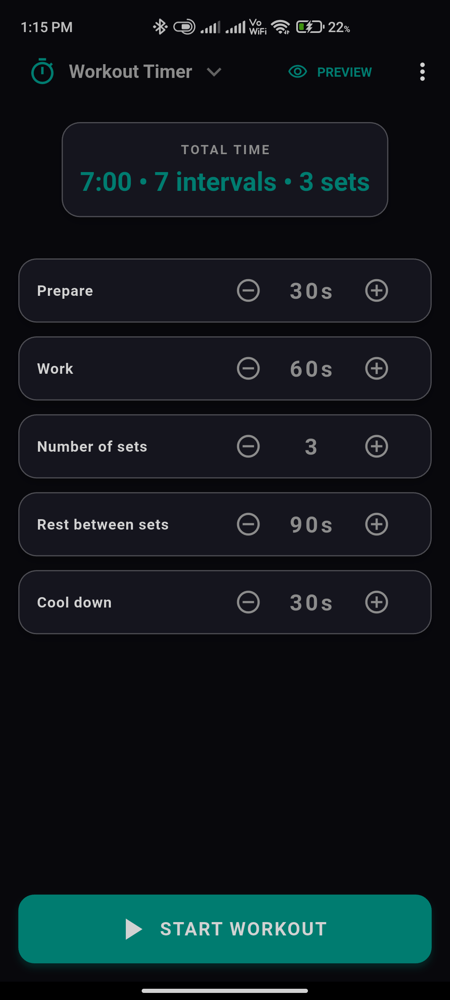
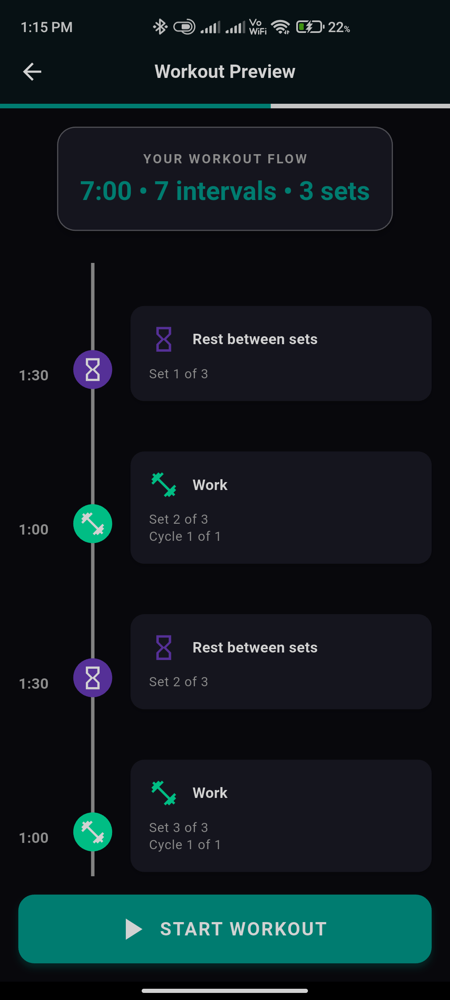
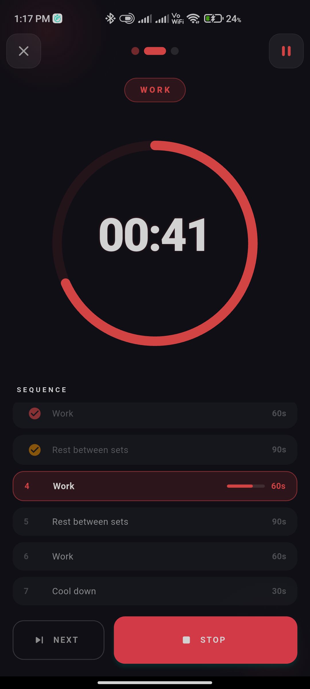
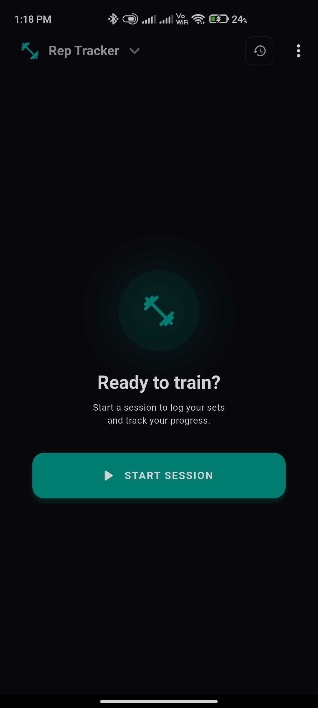
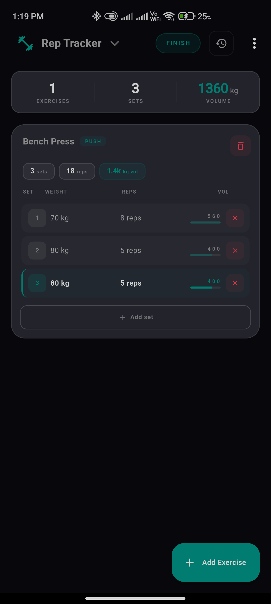
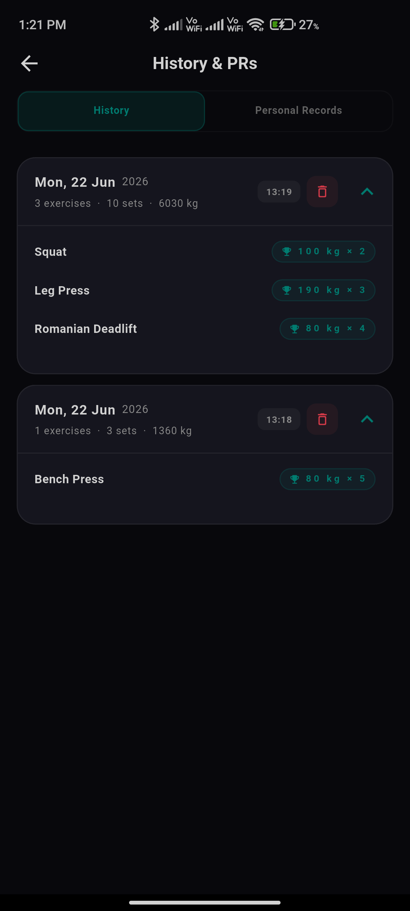
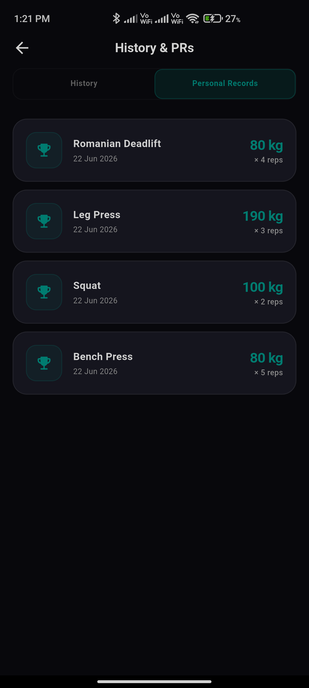
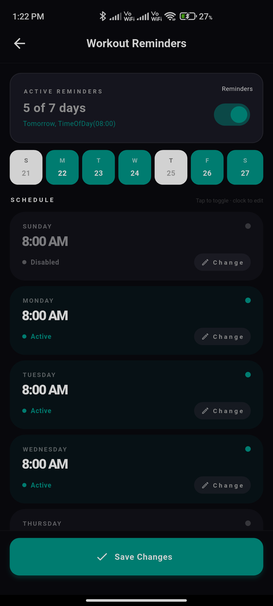
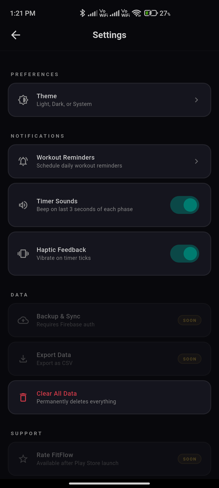

<div align="center">

# 🏋️ FitFlow

**A production-ready fitness companion — engineered with Flutter**

[](https://flutter.dev)
[](https://dart.dev)
[](LICENSE)
[](https://github.com/mohdasadkhan/workout_rep_timer/actions)
[](https://play.google.com/store)

**Package ID:** `com.asadcoder.fitness.fitflow`

[Overview](#overview) • [Features](#features) • [Under the Hood](#under-the-hood) • [Architecture](#architecture) • [Tech Stack](#tech-stack) • [Getting Started](#getting-started) • [CI/CD](#cicd-pipeline)

</div>

---

## Overview

FitFlow is not a tutorial timer app — it is a **shipping Android product** built to survive real gym conditions: screen-off intervals, backgrounded sessions, rebooted phones, and months of accumulated workout history.

The app brings together three problems that are easy to describe and hard to get right in mobile:

1. **Interval timing** that must not drift or die when the user locks their phone mid-set.
2. **Session logging** with automatic personal-record detection across a growing local dataset.
3. **Weekly reminders** that still fire after the OS reclaims memory or the device restarts.

I built FitFlow with **Clean Architecture** and **BLoC** because each of those features has non-trivial state — phase transitions, stream-driven ticks, optimistic UI during saves — and I wanted the business rules to stay testable long after the UI changes. Recent iterations focused on production hardening: configurable sound and haptics, non-blocking startup for app metadata, a consolidated settings surface with safe data wipe, and a CI pipeline that builds and ships release bundles to Google Play.

---

## Features

### ⏱️ Tabata Interval Timer

The timer is fully configurable — prepare, work, rest, cycles, sets, inter-set rest, and cool down — with a preview screen so athletes can sanity-check a protocol before the first beep.

The real engineering challenge is **lifecycle resilience**. A `Timer.periodic` in a widget is not enough; Android will suspend the Dart isolate when the app backgrounds. FitFlow runs the active session as a **foreground service** via `flutter_foreground_task`, keeping the tick stream alive and surfacing a persistent notification with Pause and Stop controls. The running screen was refactored into focused widgets to keep presentation logic readable as the state machine grew.

| Dashboard | Preview | Active session |
|:---:|:---:|:---:|
|  |  |  |

---

### 📋 Rep Tracker

Users log exercises, sets, weight, and reps mid-session — adding movements on the fly without losing context. Every completed session is persisted locally and surfaced in a searchable history timeline.

The harder problem is **PR detection at scale**. Rather than maintaining a separate PR table, the repository scans the full Hive-backed session graph and derives the heaviest set per exercise name on demand — keeping writes simple while still giving accurate bests across nested exercise → set schemas. Domain entities stay pure; Hive type adapters handle serialization at the data boundary.

| Session hub | Live logging | History | Personal records |
|:---:|:---:|:---:|:---:|
|  |  |  |  |

---

### 🔔 Smart Workout Reminders

Each day of the week gets an independent toggle and time picker, so a split routine (e.g., push on Monday, pull on Thursday) maps cleanly to the data model.

Reliability was the design constraint. Reminders are scheduled with `zonedSchedule`, `AndroidScheduleMode.exactAllowWhileIdle`, and `DateTimeComponents.dayOfWeekAndTime` — aligning with Android's alarm APIs so notifications survive app kills and **device reboots**. Rotating title copy keeps nudges from feeling robotic without complicating the scheduling layer.



---

### 🌙 Settings & Polish

Theme preference (dark by default), sound and haptic toggles, dynamic app version via `package_info_plus`, and a guarded **Clear All Data** path that wipes both Hive boxes and SharedPreferences — because production apps need an honest reset switch.



---

## Under the Hood

This section is for engineers evaluating *how* the app behaves when the happy path ends.

### Why BLoC for timers and tracking

Both the Tabata timer and the rep-tracker session flow are **state machines disguised as UI**. The timer moves through prepare → work → rest → cycle boundaries with tick events arriving every second; the workout session coordinates active exercises, in-progress sets, saves, and PR refreshes. BLoC gives each feature an explicit event → state contract, which makes the timer phase logic and session transitions testable with `bloc_test` without spinning up widgets. Streams map naturally to `TimerTicked` and notification callbacks from the foreground isolate back to the main `TimerBloc`.

### Background execution for the Tabata timer

When a session starts, FitFlow promotes the timer to a **foreground service** using `flutter_foreground_task`. A dedicated `TimerTaskHandler` runs in the service isolate; notification button presses send actions (`pause`, `stop`) back to the main isolate via `FlutterForegroundTask.sendDataToMain`, where the BLoC applies them to the authoritative state. This pattern prevents the OS from killing the active tick stream during a locked-screen HIIT round — the same class of problem that breaks naive `Timer` implementations in production fitness apps.

### Notifications that outlive reboots

Weekly reminders go through `NotificationReminderService`, which initializes timezone data and calls `zonedSchedule` with:

- `androidScheduleMode: AndroidScheduleMode.exactAllowWhileIdle` — requests exact alarm delivery even in Doze.
- `matchDateTimeComponents: DateTimeComponents.dayOfWeekAndTime` — re-anchors the next fire time after each delivery, including post-reboot rescheduling handled by the plugin and OS alarm manager.

Each weekday maps to a stable notification ID so enable/disable updates cancel and replace the correct alarm without orphan schedules.

### Data layer: Hive vs SharedPreferences

| Store | Responsibility | Rationale |
|---|---|---|
| **Hive** | Workout sessions, exercises, sets, PR source data | Binary, box-oriented storage with generated type adapters — fast reads/writes for nested session graphs and history scans. |
| **SharedPreferences** | Theme, sound/haptic flags, timer presets, lightweight toggles | Key-value access for small primitives without opening a database for every settings read. |

The split keeps hot-path session I/O off SharedPreferences' async string serialization while avoiding Hive ceremony for a boolean dark-mode flag. `Clear All Data` intentionally clears **both** layers so no stale preference survives a wipe.

---

## Architecture

FitFlow follows **Clean Architecture** with a strict three-layer separation:

```
┌──────────────────────────────────┐
│        PRESENTATION LAYER        │
│  Screens · BLoC · Widgets        │
│  No business logic in UI         │
└──────────────┬───────────────────┘
               │
┌──────────────┴───────────────────┐
│           DOMAIN LAYER           │
│  Entities · Use Cases · Repos    │
│  Pure Dart — zero Flutter deps   │
└──────────────┬───────────────────┘
               │
┌──────────────┴───────────────────┐
│            DATA LAYER            │
│  Repositories · Data Sources     │
│  SharedPreferences / Hive        │
└──────────────────────────────────┘
```

That separation is deliberate, not ceremonial. Domain use cases (`GetPersonalRecords`, timer configuration validation, reminder scheduling contracts) compile without importing `flutter_local_notifications`, `hive_flutter`, or `flutter_foreground_task`. Presentation BLoCs depend on interfaces; data implementations swap storage or plugins behind the same repository API. The payoff is **unit tests on business rules with mocks**, and the freedom to change a plugin version or datasource without rewriting session logic.

### Project Structure

```
lib/
├── core/
│   ├── theme/          # AppColors, AppTextStyles, AppTheme
│   ├── router/         # GoRouter configuration
│   ├── di/             # GetIt dependency injection
│   ├── constants/      # Shared constants & pref keys
│   ├── failure/        # Error handling (Dartz Either)
│   ├── services/       # Shared services
│   └── widgets/        # Reusable core widgets
│
└── features/
    ├── workout_timer/  # Tabata timer feature
    ├── rep_tracker/    # Session logging + history + PRs
    ├── reminder/       # Scheduled workout notifications
    ├── settings/       # Theme & app preferences
    └── notification/   # FCM + local notification handling
```

Each feature follows the same internal structure:

```
feature/
├── domain/
│   ├── entities/
│   ├── repositories/   # Interfaces only
│   └── usecases/
├── data/
│   ├── datasources/
│   ├── models/
│   └── repositories/   # Implementations
└── presentation/
    ├── bloc/
    ├── screens/
    └── widgets/
```

---

## Tech Stack

| Category | Package | Version |
|---|---|---|
| State Management | `flutter_bloc` | ^9.1.1 |
| Dependency Injection | `get_it` | ^9.2.1 |
| Navigation | `go_router` | ^17.1.0 |
| Local Storage | `shared_preferences` | ^2.5.5 |
| Key-Value DB | `hive` + `hive_flutter` | ^2.2.3 |
| Notifications | `flutter_local_notifications` | ^20.1.0 |
| Background Service | `flutter_foreground_task` | ^9.2.1 |
| Push Notifications | `firebase_messaging` | ^16.1.3 |
| Firebase Core | `firebase_core` | ^4.6.0 |
| Audio | `just_audio` | ^0.10.5 |
| Functional Programming | `dartz` | ^0.10.1 |
| Equality | `equatable` | ^2.0.8 |
| Timezone | `timezone` | ^0.10.1 |
| Internationalization | `intl` | ^0.20.2 |
| Permissions | `permission_handler` | ^12.0.1 |
| Animations | `flutter_staggered_animations` | ^1.1.1 |
| Timeline UI | `timeline_tile` | ^2.0.0 |
| Splash Screen | `flutter_native_splash` | ^2.4.7 |

---

## Getting Started

### Prerequisites

- Flutter SDK `>=3.0.0`
- Dart SDK `>=3.0.0`
- Android Studio or VS Code
- A Firebase project (for push notifications)

### Setup

```bash
# Clone the repo
git clone https://github.com/mohdasadkhan/workout_rep_timer.git
cd workout_rep_timer

# Install dependencies
flutter pub get

# Run code generation (if needed)
flutter packages pub run build_runner build --delete-conflicting-outputs

# Run on device
flutter run
```

### Firebase Setup

1. Create a project at [Firebase Console](https://console.firebase.google.com)
2. Add an Android app with package name `com.asadcoder.fitness.fitflow`
3. Download `google-services.json` and place it in `android/app/`
4. Enable **Cloud Messaging** in your Firebase project

> ⚠️ `google-services.json` is excluded from version control. Never commit it.

---

## CI/CD Pipeline

FitFlow uses **GitHub Actions** for automated builds and Play Store deployment.

### What the pipeline does

1. **Trigger** — Runs on every push to the `main` branch
2. **Setup** — Configures Flutter SDK and Java environment
3. **Dependencies** — Installs all pub packages
4. **Secrets injection** — Decodes `google-services.json` from GitHub Secrets
5. **Build** — Compiles a release Android App Bundle (`.aab`)
6. **Deploy** — Uploads the AAB directly to Google Play (Internal / Closed Testing track) via the [Google Play Upload GitHub Action](https://github.com/r0adkll/upload-google-play)

### Secrets required

| Secret | Description |
|---|---|
| `GOOGLE_SERVICES_JSON` | Base64-encoded `google-services.json` |
| `KEYSTORE_FILE` | Base64-encoded release keystore |
| `KEY_ALIAS` | Keystore key alias |
| `KEY_PASSWORD` | Key password |
| `STORE_PASSWORD` | Keystore store password |
| `SERVICE_ACCOUNT_JSON` | Google Play service account credentials |

---

## Roadmap

- [ ] Migrate from SharedPreferences to Drift (SQLite) for better query performance
- [ ] Add pagination to workout history
- [ ] Expand unit coverage for PR calculation and timer state machine edge cases
- [ ] Exercise library with suggested workouts
- [ ] iOS support & App Store release
- [ ] Widget for home screen workout streak

---

## Contributing

Contributions are welcome. Open an issue or submit a pull request.

1. Fork the repository
2. Create a feature branch: `git checkout -b feature/your-feature`
3. Commit your changes: `git commit -m 'feat: add your feature'`
4. Push to the branch: `git push origin feature/your-feature`
5. Open a Pull Request

---

## Author

**Asad Khan**
- GitHub: [@mohdasadkhan](https://github.com/mohdasadkhan)

---

## License

This project is licensed under the MIT License — see the [LICENSE](LICENSE) file for details.
